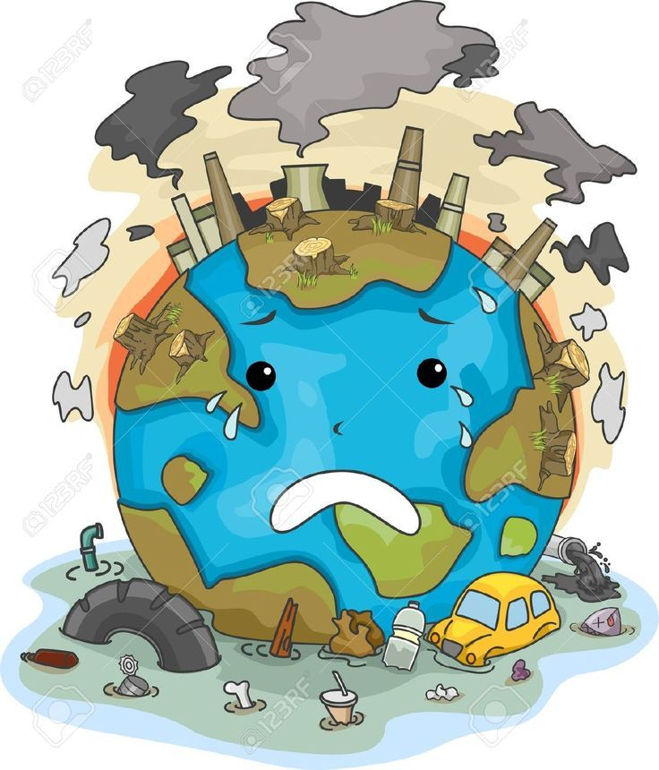

## Machine Learning Challenges
### 1. Air Pollution Problem
        - Technology used : Linear Regression with multiple features

Air samples of different locations were taken and then five features of the air were extracted. Then the air quality index was calculated in the training data.

**Goal** : Design a machine learning model which can predict air quality index for testing data.

### 2. Diabetes Challenge 
        - Technology used : K-Nearest Neighbor Classification

In this problem you are given a Diabetes Data set consisting of following features - ['Pregnancies', 'Glucose', 'BloodPressure', 'SkinThickness', 'Insulin', 'BMI', 'DiabetesPedigreeFunction', 'Age', 'Outcome'] The task is to predict whether a person is suffering from diabetes or not (Binary Classification)

**Goal** : Design a machine learning model which can classify a person as 0 or 1 (Diabetic or Not) using K-Nearest Neighbors classifier.

### 2. Sentiment Analysis
        - Technology used : Neural Networks

In this problem you load imdb dataset including reviews of various movies and their label as a good movie or a bad movie. After the training over the training data, the model predicts if a movie is a good movie or a bad movie on the basis of the sentimental words present in the review.

**Goal** : Design a machine learning model which can predict a movie review as 0 or 1 (Good movie or a bad movie) using simple 3-layer Neural Network.